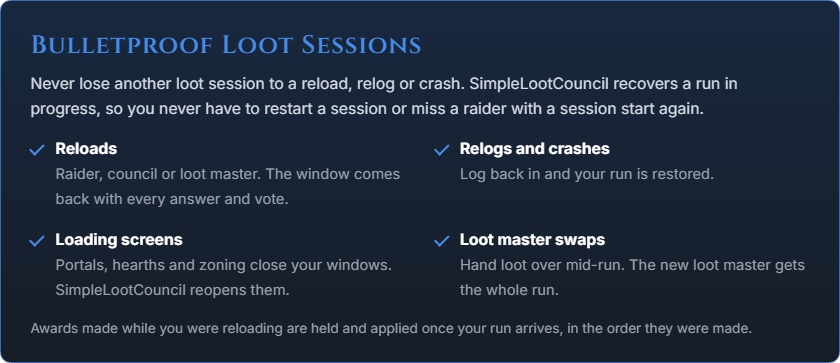

  
  
  
  

**SimpleLootCouncil** is a loot council for **Retail and Forever** raids. Where there is no master looter, the council votes on items sitting in a raider's bags inside the two-hour trade window. Raiders answer, the council votes, the loot master awards, and the holder's trade window fills itself.

## Built for Retail Loot and WoW Forever

Votes happen on items still inside their trade window. When an item is awarded, its holder is told, and opening a trade with the winner fills it automatically. An award only counts as **delivered** once the item has actually changed hands.

On **WoW Forever**, master loot is back. The loot master holds the drop, the council votes the same way, and the item goes straight to the winner.

## Light on Screen Space

SimpleLootCouncil gives you compact frame options for the council voting frame and the loot response frames, taking up less screen real estate, making it easier to keep playing while managing loot.

## Performant at Any Scale

Answers from a 40-player raid cost about 0.04 ms each. The council table redraws in place, at most a few times a second, and addon messages are paced so other addons are never crowded out.

## Bring Your History

Import award history from RCLootCouncil or Loothing, from saved data or a pasted CSV, so your council isn't starting blind.

## Features

- Live council voting
- Custom response buttons
- Council by name or guild rank
- Loot master delegation
- Autopass on unusable gear
- Equipped-gear and tier-set comparison
- Bonus-roll tracking
- Rolls, asked or generated
- Whisper answers for players without the addon
- Raid team view by guild rank
- Attendance
- CSV export
- WowUtils wishlist support
- SimulationCraft export

## Languages

SimpleLootCouncil runs on every World of Warcraft client language: rolls are read from chat, plurals and punctuation follow your language, and Cyrillic, Korean and Chinese text draws in the right font.

English (enUS, enGB) · Deutsch (deDE) · Français (frFR) · Español (esES, esMX) · Italiano (itIT) · Português (ptBR) · Русский (ruRU) · 한국어 (koKR) · 简体中文 (zhCN) · 繁體中文 (zhTW)

All interface text is English for now. Full translation is the next goal for SLC, but making sure it ran on every client localization was a top priority.

Every string is ready to translate. Translators are deeply desired, and any interested parties are encouraged to join the [Discord](https://discord.gg/nNRfxQApEB)!

## SimpleLootCouncil is currently in public beta testing, if you encounter issues please report them.

## Getting Started

Install it with WowUp: **Install from URL** with this repo's address. Everyone who takes part needs it. The group leader runs loot by default. Add your council with `/slc council add Name-Realm`, and type `/slc` for settings or `/slc help` for every command.

## Support

Found a bug? [Open an issue](https://github.com/SimpleLootCouncil/SimpleLootCouncil/issues/new/choose) with your version and what `/slc log` shows.

SimpleLootCouncil is free. If it saves your raid some arguing, you can support its development on [Ko-fi](https://ko-fi.com/laxxz).

Written from scratch. No code from other loot addons.

## Check out [SLCLauncher](https://github.com/Laxxzz/SLCLauncher) to set and forget all your wow related applications, and have them close when wow does if you want!

## Licence

All rights reserved - see [LICENSE](LICENSE). You are welcome to use the addon;
redistributing it or reusing its source needs a word first.

https://www.curseforge.com/wow/addons/simplelootcouncil

https://addons.wago.io/addons/simplelootcouncil
